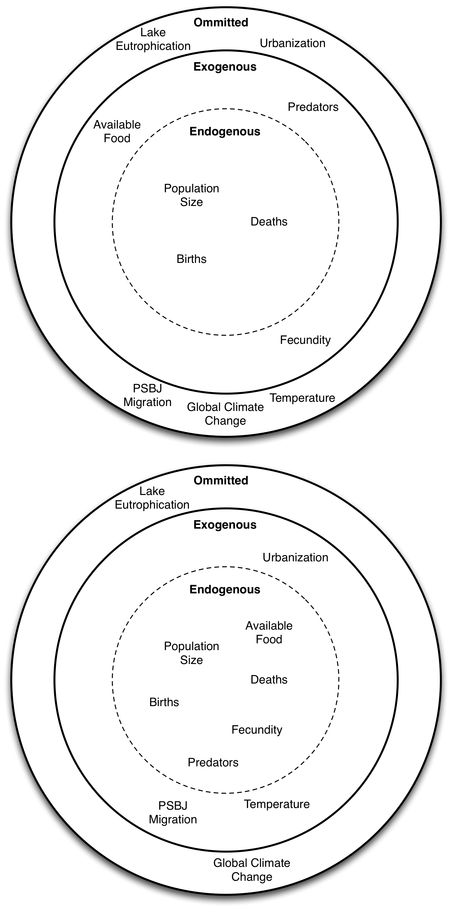

# References for today's class

# Why? do we build models 
* Models to study something
** In silicon experimentation
** Model based experimental design
** Ethics concerns
** Complexity, emergent behaviors and other confounders

* Models to explain
**  Models to persuade  
** difference is in persuasive models we may take liberties with parameters to get desired results; 
** the level of liberties taken is on your conscience

* Models to predict behavior of a complex system where we know the parts but not always how they work together
** Does this work better than a statistical model? Machine learning? Neural network? (all are fancy regressions anyway)

* Models to control a complex system 
** model predictive control 
** open loop vs closed loop systems 
** using models instead of a measurement of reality

## Truth and Complexity

Truth - or actually “truthiness” — all models are false, some are useful
* (but some are less false than others) 

Model complexity — from toys to kitchen sinks
How much tuning is too much? Creationism and software engineers chutzpah 

Validation and verification — difference between the two 
* Face validity / duck validity (if it looks like a duck) ; 
* distribution validity; parametric validity; numerical validity

## Rob Axtell's Model Hierarchy

Original paper: https://pdfs.semanticscholar.org/17d3/21793b9f55864c90ba0e4f094a0474edd1e5.pdf

*Level 0:* The model is a caricature of reality, as established through the use ofsimple graphical devices (e.g., allowing visualization of agent motion);

*Level 1:* The model is in qualitative agreement with empirical macro- structures,as established by plotting, say, distributional properties of the agentpopulation;

*Level 2:* The model produces quantitative agreement with empirical macro-structures, as established through on-board statistical estimationroutines; 

*Level 3:* The model exhibits quantitative agreement with empirical micro-structures, as determined from cross-sectional and longitudinal analysisof the agent population.

## Shelling's Segregation Model
*Original paper*
https://www.stat.berkeley.edu/~aldous/157/Papers/Schelling_Seg_Models.pdf

*browser version*
http://netlogoweb.org/launch#http://netlogoweb.org/assets/modelslib/Sample%20Models/Social%20Science/Segregation.nlogo

*good paper extending the model*
http://jasss.soc.surrey.ac.uk/15/1/6.html

## What do we model
* drawing system boundaries — is a variable necessary, sufficient, or extraneous and confounding?

(from https://realkm.com/2017/11/07/the-process-of-modeling-model-boundaries-systems-thinking-modelling-series/)
    ** Endogenous: Endogenous items are at the core of the model. They are things that the model itself determines. For instance, the size of the hamster population is endogenous to the model. The model itself simulates this population.

    ** Exogenous: Exogenous items are those that you include in the model but which you do not directly simulate. For instance, if we thought temperature had a significant effect on hamster survival, we might want to include historical temperature data in the model. We do not want to simulate this data though, we just want to use it as an exogenous input into the model.

    ** Omitted: Omitted items are those that we choose not to include in the model, even though we may acknowledge their existence and potential (direct or indirect) impact on the hamsters. Even the most ambitious and comprehensive model will need to draw the line somewhere.
    

* time scales  — fast and slow processes

## Defining model elements
* Model domain / environment 
* Actors and agents (stocks and flows) -- what moves and how? how do things that move interact?
* What is time? What is space? What is love (baby don't hurt me)

## How do we model? 

* System dynamics
* Microsimulation 
* Markov chains / causal networks
* Agent based models 
* Stats, ML, Neural network models and other fancy regressions
* Graph models.
